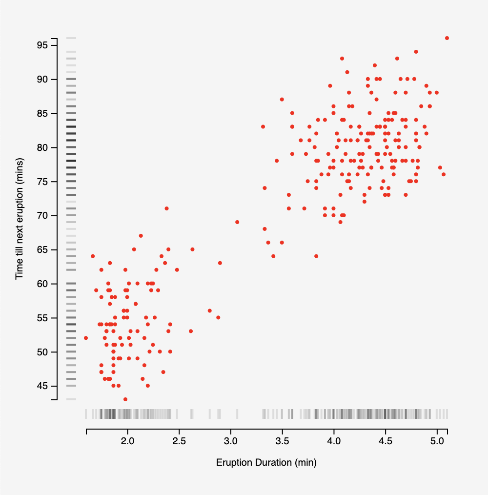

# FancyAxis

This is a package to draw fancier axes in D3 for your graphs, based on the visual style of Edward Tufte, and on this previous work done in R:
- docs: https://www.cl.cam.ac.uk/~sjm217/projects/graphics/
- code: https://www.cl.cam.ac.uk/~sjm217/projects/graphics/fancyaxis.R

## Usage

### Node

Install via npm:
```shell
npm install fancy-axis
```

and import:
```ts
import { rugPlot } from "fancy-axis";
```

### Script

You can also load the script directly on the page, and it will be stored globally:
```html
<script src="https://unpkg.com/fancy-axis@0.0.2"></script>
<script>
    const { rugPlot } = fancyAxis;
</script>
```

## Features

### Rug Plot

Use in place of `d3.axisBottom` and `d3.axisLeft`. All methods that are available on the result of `d3.axisBottom` and `d3.axisLeft` are available on the rug plot as well. So:
```ts
rugPlot.axisLeft(yScale).scale(); // returns yScale again
```

#### Usage

There are two methods available on the rugPlot axis specific to this library.

Name | type | required | Notes
--- | --- | --- | ---
`x` | `y` | func | false | x is available on axisBottom only, and y on axisLeft only. It will be passed each data point and the index as arguments: `(data: any, index: number) => any`
`datum` | iterable | true | the data for your graph.

```ts
import { rugPlot } from "fancy-axis";

// create your scale..

// dataset is like [{y: ... }, ...]

let leftAxis = rugPlot.axisLeft(yScale).datum(dataset).y(d => d.y);

svg.append("g")
    .attr("class", "y axis")
    .call(leftAxis); // Create an axis component with d3.axisLeft
```

You will need to do both axes for it to display correctly. If you do not want the rug plot on the other axis, you can do the following:

```js
let bottomAxis = rugPlot.axisBottom(xScale);
```

And it will not render the data, but the padding will be correct.




#### Options

Passing these options can help customize the rug plot.

Name | type | Notes
--- | --- | ---
`width` | number | width of the rug 'tassels'
`color` | string | css color of the rug 'tassels'
`strokeWidth` | number | thickness of the rug 'tassels'

These options help create the below graph:
```ts
const bottomAxis = rugPlot
    .axisBottom(xScale, {
        width: 10,
        color: "rgba(0, 0, 0, 0.1)",
        strokeWidth: 2,
    })
    .datum(dataset)
    .x((d) => d[0]);
```
